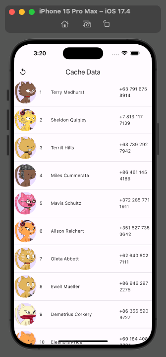

# cachdatabase

A Flutter project demonstrating how to manage cached data and update it automatically with the latest data from the server. In case the server is not accessible, it should load the cached data.

## Getting Started

[find me here ](http://zahmatkesh.dev), to hire :sunglasses:,

